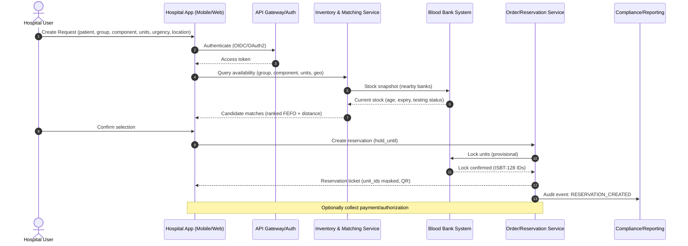
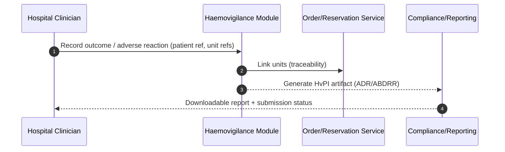

---

# Sequence Diagrams (text-first)

## 1) Online Booking & Auto-Matching (Hospital → Network)



## 2) Blood Bank Fulfilment & Handover to Courier

```mermaid
sequenceDiagram
  autonumber
  participant BB as Blood Bank Operator UI
  participant ORD as Order/Reservation Service
  participant LAB as Testing/Label Service
  participant LBL as Traceability (ISBT-128)
  participant LOG as Logistics Orchestrator
  participant COU as Courier App

  ORD->>BB: Pick list (units, priority, expiry)
  BB->>LAB: Verify testing complete (serology/NAT)
  LAB-->>BB: Pass/Fail + certificates
  BB->>LBL: Validate barcodes & pack list
  LBL-->>BB: Seal ID + chain-of-custody token

  BB->>LOG: Request pickup (pickup, drop, SLA, special handling)
  LOG-->>COU: Job assignment (route, ETA, token)
  COU->>BB: Arrive & scan (unit_ids, seal, token)
  BB-->>COU: Release units
  ORD->>BB: Deduct inventory; finalize issue
  ORD-->>LOG: Mark DISPATCHED
```

## 3) Cold-Chain Delivery & Proof-of-Delivery

```mermaid
sequenceDiagram
  autonumber
  participant COU as Courier App
  participant TEL as Telemetry (GPS/Temp)
  participant LOG as Logistics Orchestrator
  participant HOS as Hospital Receiving
  participant ORD as Order/Reservation Service
  participant REP as Compliance/Reporting

  COU->>TEL: Start trip; attach temp logger
  TEL-->>LOG: Streaming telemetry (GPS, temp)
  alt Temp breach or delay risk
    LOG->>COU: Alert & mitigation (reroute, swap ice packs)
    LOG->>REP: Incident recorded
  end

  COU->>HOS: Arrive; scan units + enter OTP
  HOS-->>COU: Acceptance
  COU->>ORD: Submit Proof-of-Delivery (timestamps, scans, temp trace)
  ORD-->>REP: Audit event: DELIVERY_CONFIRMED
  LOG-->>TEL: Stop telemetry; archive trace
```

## 4) Haemovigilance & Exception Reporting (Post-Transfusion)



---

# PostgreSQL DDL (runnable)

> Notes
> • Uses enums for blood group, component, and statuses.
> • Enforces FEFO by indexing expiries.
> • ISBT-128 IDs unique.
> • JSONB `meta` fields for flexible extensions.
> • Time-series telemetry separated from transactional tables.

```sql
-- =========================
-- SCHEMA & EXTENSIONS
-- =========================
CREATE SCHEMA IF NOT EXISTS bloodnet;
CREATE EXTENSION IF NOT EXISTS "uuid-ossp";

-- =========================
-- ENUMS
-- =========================
DO $$
BEGIN
  IF NOT EXISTS (SELECT 1 FROM pg_type WHERE typname = 'blood_group') THEN
    CREATE TYPE bloodnet.blood_group AS ENUM ('A+', 'A-', 'B+', 'B-', 'AB+', 'AB-', 'O+', 'O-');
  END IF;

  IF NOT EXISTS (SELECT 1 FROM pg_type WHERE typname = 'component_type') THEN
    CREATE TYPE bloodnet.component_type AS ENUM ('WB', 'PRBC', 'FFP', 'Platelets', 'Cryo', 'Plasma');
  END IF;

  IF NOT EXISTS (SELECT 1 FROM pg_type WHERE typname = 'testing_status') THEN
    CREATE TYPE bloodnet.testing_status AS ENUM ('PENDING', 'PASSED', 'FAILED', 'WAIVED');
  END IF;

  IF NOT EXISTS (SELECT 1 FROM pg_type WHERE typname = 'reservation_status') THEN
    CREATE TYPE bloodnet.reservation_status AS ENUM ('HELD', 'CONFIRMED', 'PARTIAL', 'CANCELLED', 'EXPIRED', 'FULFILLED');
  END IF;

  IF NOT EXISTS (SELECT 1 FROM pg_type WHERE typname = 'delivery_status') THEN
    CREATE TYPE bloodnet.delivery_status AS ENUM ('ASSIGNED', 'PICKED_UP', 'IN_TRANSIT', 'BREACH', 'DELIVERED', 'RETURNED', 'CANCELLED');
  END IF;

  IF NOT EXISTS (SELECT 1 FROM pg_type WHERE typname = 'incident_severity') THEN
    CREATE TYPE bloodnet.incident_severity AS ENUM ('INFO', 'LOW', 'MEDIUM', 'HIGH', 'CRITICAL');
  END IF;
END$$;

-- =========================
-- CORE REFERENCE TABLES
-- =========================
CREATE TABLE IF NOT EXISTS bloodnet.organizations (
  id               UUID PRIMARY KEY DEFAULT uuid_generate_v4(),
  org_type         TEXT NOT NULL CHECK (org_type IN ('HOSPITAL','BLOOD_BANK','COURIER','ADMIN')),
  name             TEXT NOT NULL,
  address          TEXT,
  city             TEXT,
  state            TEXT,
  pincode          TEXT,
  latitude         NUMERIC(9,6),
  longitude        NUMERIC(9,6),
  license_no       TEXT,       -- for blood banks
  license_valid_till DATE,
  meta             JSONB DEFAULT '{}'::jsonb,
  created_at       TIMESTAMPTZ NOT NULL DEFAULT now(),
  updated_at       TIMESTAMPTZ NOT NULL DEFAULT now()
);

CREATE TABLE IF NOT EXISTS bloodnet.users (
  id               UUID PRIMARY KEY DEFAULT uuid_generate_v4(),
  org_id           UUID NOT NULL REFERENCES bloodnet.organizations(id) ON DELETE CASCADE,
  role             TEXT NOT NULL CHECK (role IN ('HOSPITAL_USER','BLOOD_BANK_USER','COURIER_AGENT','ADMIN')),
  full_name        TEXT NOT NULL,
  email            TEXT UNIQUE,
  phone            TEXT,
  is_active        BOOLEAN NOT NULL DEFAULT true,
  meta             JSONB DEFAULT '{}'::jsonb,
  created_at       TIMESTAMPTZ NOT NULL DEFAULT now(),
  updated_at       TIMESTAMPTZ NOT NULL DEFAULT now()
);

-- =========================
-- BLOOD INVENTORY & TRACEABILITY
-- =========================
CREATE TABLE IF NOT EXISTS bloodnet.blood_units (
  id                UUID PRIMARY KEY DEFAULT uuid_generate_v4(),
  isbt128_id        TEXT NOT NULL UNIQUE,                 -- barcode/label ID
  blood_group       bloodnet.blood_group NOT NULL,
  component         bloodnet.component_type NOT NULL,
  collection_date   DATE NOT NULL,
  expiry_date       DATE NOT NULL,
  volume_ml         INTEGER,
  current_bank_id   UUID NOT NULL REFERENCES bloodnet.organizations(id) ON DELETE RESTRICT,
  testing_status    bloodnet.testing_status NOT NULL DEFAULT 'PENDING',
  testing_meta      JSONB DEFAULT '{}'::jsonb,            -- test types, results, cert refs
  storage_temp_min  NUMERIC(4,1),
  storage_temp_max  NUMERIC(4,1),
  status            TEXT NOT NULL DEFAULT 'AVAILABLE' CHECK (status IN ('AVAILABLE','RESERVED','ISSUED','DISCARDED','RETURNED','QUARANTINED')),
  created_at        TIMESTAMPTZ NOT NULL DEFAULT now(),
  updated_at        TIMESTAMPTZ NOT NULL DEFAULT now(),
  meta              JSONB DEFAULT '{}'::jsonb
);

CREATE INDEX IF NOT EXISTS idx_blood_units_bank ON bloodnet.blood_units(current_bank_id);
CREATE INDEX IF NOT EXISTS idx_blood_units_group_component ON bloodnet.blood_units(blood_group, component);
CREATE INDEX IF NOT EXISTS idx_blood_units_expiry ON bloodnet.blood_units(expiry_date); -- FEFO

-- =========================
-- RESERVATIONS & ORDERING
-- =========================
CREATE TABLE IF NOT EXISTS bloodnet.reservations (
  id                 UUID PRIMARY KEY DEFAULT uuid_generate_v4(),
  hospital_id        UUID NOT NULL REFERENCES bloodnet.organizations(id) ON DELETE RESTRICT,
  requester_user_id  UUID NOT NULL REFERENCES bloodnet.users(id) ON DELETE RESTRICT,
  patient_ref        TEXT,            -- ABHA or internal MRN (store minimal PHI)
  blood_group        bloodnet.blood_group NOT NULL,
  component          bloodnet.component_type NOT NULL,
  units_requested    INTEGER NOT NULL CHECK (units_requested > 0),
  urgency            TEXT CHECK (urgency IN ('ROUTINE','URGENT','EMERGENCY')),
  status             bloodnet.reservation_status NOT NULL DEFAULT 'HELD',
  hold_until         TIMESTAMPTZ,     -- auto-expire if not confirmed
  confirmed_at       TIMESTAMPTZ,
  fulfilled_at       TIMESTAMPTZ,
  cancelled_at       TIMESTAMPTZ,
  location           GEOGRAPHY(Point, 4326),  -- optional PostGIS if enabled
  meta               JSONB DEFAULT '{}'::jsonb,
  created_at         TIMESTAMPTZ NOT NULL DEFAULT now(),
  updated_at         TIMESTAMPTZ NOT NULL DEFAULT now()
);

CREATE TABLE IF NOT EXISTS bloodnet.reservation_units (
  reservation_id   UUID NOT NULL REFERENCES bloodnet.reservations(id) ON DELETE CASCADE,
  blood_unit_id    UUID NOT NULL REFERENCES bloodnet.blood_units(id) ON DELETE RESTRICT,
  bank_id          UUID NOT NULL REFERENCES bloodnet.organizations(id) ON DELETE RESTRICT,
  locked_at        TIMESTAMPTZ NOT NULL DEFAULT now(),
  PRIMARY KEY (reservation_id, blood_unit_id)
);

CREATE INDEX IF NOT EXISTS idx_reservation_units_bank ON bloodnet.reservation_units(bank_id);

-- =========================
-- LOGISTICS & DELIVERY
-- =========================
CREATE TABLE IF NOT EXISTS bloodnet.delivery_jobs (
  id                 UUID PRIMARY KEY DEFAULT uuid_generate_v4(),
  reservation_id     UUID NOT NULL REFERENCES bloodnet.reservations(id) ON DELETE CASCADE,
  courier_org_id     UUID NOT NULL REFERENCES bloodnet.organizations(id) ON DELETE RESTRICT,
  courier_agent_id   UUID REFERENCES bloodnet.users(id) ON DELETE SET NULL,
  pickup_bank_id     UUID NOT NULL REFERENCES bloodnet.organizations(id) ON DELETE RESTRICT,
  drop_hospital_id   UUID NOT NULL REFERENCES bloodnet.organizations(id) ON DELETE RESTRICT,
  status             bloodnet.delivery_status NOT NULL DEFAULT 'ASSIGNED',
  seal_id            TEXT,
  chain_token        TEXT,     -- chain-of-custody token
  eta_pickup         TIMESTAMPTZ,
  eta_drop           TIMESTAMPTZ,
  picked_up_at       TIMESTAMPTZ,
  delivered_at       TIMESTAMPTZ,
  returned_at        TIMESTAMPTZ,
  meta               JSONB DEFAULT '{}'::jsonb,
  created_at         TIMESTAMPTZ NOT NULL DEFAULT now(),
  updated_at         TIMESTAMPTZ NOT NULL DEFAULT now()
);

CREATE TABLE IF NOT EXISTS bloodnet.delivery_job_units (
  delivery_job_id  UUID NOT NULL REFERENCES bloodnet.delivery_jobs(id) ON DELETE CASCADE,
  blood_unit_id    UUID NOT NULL REFERENCES bloodnet.blood_units(id) ON DELETE RESTRICT,
  PRIMARY KEY (delivery_job_id, blood_unit_id)
);

CREATE TABLE IF NOT EXISTS bloodnet.delivery_events (
  id               UUID PRIMARY KEY DEFAULT uuid_generate_v4(),
  delivery_job_id  UUID NOT NULL REFERENCES bloodnet.delivery_jobs(id) ON DELETE CASCADE,
  event_type       TEXT NOT NULL,  -- ASSIGNED, ARRIVED_PICKUP, PICKED_UP, IN_TRANSIT, ARRIVED_DROP, DELIVERED, BREACH, RETURNED
  event_ts         TIMESTAMPTZ NOT NULL DEFAULT now(),
  payload          JSONB DEFAULT '{}'::jsonb
);

-- =========================
-- TELEMETRY (TIME-SERIES)
-- =========================
CREATE TABLE IF NOT EXISTS bloodnet.telemetry_devices (
  id               UUID PRIMARY KEY DEFAULT uuid_generate_v4(),
  device_serial    TEXT UNIQUE NOT NULL,
  type             TEXT NOT NULL,      -- e.g., TEMP_LOGGER
  meta             JSONB DEFAULT '{}'::jsonb,
  created_at       TIMESTAMPTZ NOT NULL DEFAULT now()
);

CREATE TABLE IF NOT EXISTS bloodnet.telemetry_streams (
  id               UUID PRIMARY KEY DEFAULT uuid_generate_v4(),
  delivery_job_id  UUID NOT NULL REFERENCES bloodnet.delivery_jobs(id) ON DELETE CASCADE,
  device_id        UUID NOT NULL REFERENCES bloodnet.telemetry_devices(id) ON DELETE RESTRICT,
  started_at       TIMESTAMPTZ NOT NULL DEFAULT now(),
  ended_at         TIMESTAMPTZ
);

CREATE TABLE IF NOT EXISTS bloodnet.telemetry_points (
  stream_id        UUID NOT NULL REFERENCES bloodnet.telemetry_streams(id) ON DELETE CASCADE,
  ts               TIMESTAMPTZ NOT NULL,
  temperature_c    NUMERIC(4,1),
  latitude         NUMERIC(9,6),
  longitude        NUMERIC(9,6),
  PRIMARY KEY (stream_id, ts)
);

CREATE INDEX IF NOT EXISTS idx_telemetry_points_time ON bloodnet.telemetry_points(stream_id, ts);

-- =========================
-- COMPLIANCE, INCIDENTS & HEMOVIGILANCE
-- =========================
CREATE TABLE IF NOT EXISTS bloodnet.compliance_events (
  id               UUID PRIMARY KEY DEFAULT uuid_generate_v4(),
  org_id           UUID REFERENCES bloodnet.organizations(id) ON DELETE SET NULL,
  reservation_id   UUID REFERENCES bloodnet.reservations(id) ON DELETE SET NULL,
  delivery_job_id  UUID REFERENCES bloodnet.delivery_jobs(id) ON DELETE SET NULL,
  blood_unit_id    UUID REFERENCES bloodnet.blood_units(id) ON DELETE SET NULL,
  type             TEXT NOT NULL,      -- e.g., NAT_PENDING, TEMP_BREACH, LABEL_MISMATCH
  severity         bloodnet.incident_severity NOT NULL DEFAULT 'INFO',
  details          JSONB DEFAULT '{}'::jsonb,
  created_at       TIMESTAMPTZ NOT NULL DEFAULT now()
);

CREATE TABLE IF NOT EXISTS bloodnet.hvpi_reports (
  id               UUID PRIMARY KEY DEFAULT uuid_generate_v4(),
  hospital_id      UUID NOT NULL REFERENCES bloodnet.organizations(id) ON DELETE RESTRICT,
  clinician_user_id UUID REFERENCES bloodnet.users(id) ON DELETE SET NULL,
  patient_ref      TEXT,     -- keep minimal identifiers
  reaction_type    TEXT,     -- classify ADR
  severity         TEXT,     -- mild/moderate/severe
  outcome          TEXT,     -- recovered, ongoing, fatal, etc.
  related_units    UUID[] NOT NULL,  -- refs to blood_units.id
  report_json      JSONB DEFAULT '{}'::jsonb,
  submitted_at     TIMESTAMPTZ,
  created_at       TIMESTAMPTZ NOT NULL DEFAULT now()
);

-- =========================
-- INTEGRATIONS & AUDIT
-- =========================
CREATE TABLE IF NOT EXISTS bloodnet.integrations (
  id               UUID PRIMARY KEY DEFAULT uuid_generate_v4(),
  org_id           UUID NOT NULL REFERENCES bloodnet.organizations(id) ON DELETE CASCADE,
  system           TEXT NOT NULL,      -- e.g., ERAKTKOSH, ABDM, EHR
  status           TEXT NOT NULL CHECK (status IN ('ACTIVE','DISABLED')),
  config           JSONB NOT NULL,
  created_at       TIMESTAMPTZ NOT NULL DEFAULT now(),
  updated_at       TIMESTAMPTZ NOT NULL DEFAULT now()
);

CREATE TABLE IF NOT EXISTS bloodnet.api_keys (
  id               UUID PRIMARY KEY DEFAULT uuid_generate_v4(),
  org_id           UUID NOT NULL REFERENCES bloodnet.organizations(id) ON DELETE CASCADE,
  name             TEXT NOT NULL,
  hashed_key       TEXT NOT NULL,
  scopes           TEXT[] NOT NULL,
  is_active        BOOLEAN NOT NULL DEFAULT true,
  created_at       TIMESTAMPTZ NOT NULL DEFAULT now()
);

CREATE TABLE IF NOT EXISTS bloodnet.audit_log (
  id               BIGSERIAL PRIMARY KEY,
  actor_user_id    UUID REFERENCES bloodnet.users(id) ON DELETE SET NULL,
  org_id           UUID REFERENCES bloodnet.organizations(id) ON DELETE SET NULL,
  action           TEXT NOT NULL,
  entity_type      TEXT NOT NULL,
  entity_id        UUID,
  diff             JSONB,
  created_at       TIMESTAMPTZ NOT NULL DEFAULT now()
);

-- =========================
-- TRIGGERS & HOUSEKEEPING
-- =========================

-- Auto-expire reservations past hold_until
CREATE OR REPLACE FUNCTION bloodnet.expire_reservations() RETURNS trigger AS $$
BEGIN
  IF NEW.hold_until IS NOT NULL AND NEW.hold_until < now() AND NEW.status = 'HELD' THEN
    NEW.status := 'EXPIRED';
  END IF;
  RETURN NEW;
END;
$$ LANGUAGE plpgsql;

DROP TRIGGER IF EXISTS trg_reservation_expire ON bloodnet.reservations;
CREATE TRIGGER trg_reservation_expire
BEFORE UPDATE ON bloodnet.reservations
FOR EACH ROW
EXECUTE PROCEDURE bloodnet.expire_reservations();

-- Maintain updated_at
CREATE OR REPLACE FUNCTION bloodnet.touch_updated_at() RETURNS trigger AS $$
BEGIN
  NEW.updated_at := now();
  RETURN NEW;
END;
$$ LANGUAGE plpgsql;

DO $$
BEGIN
  IF NOT EXISTS (SELECT 1 FROM pg_trigger WHERE tgname = 'trg_touch_orgs') THEN
    CREATE TRIGGER trg_touch_orgs BEFORE UPDATE ON bloodnet.organizations
      FOR EACH ROW EXECUTE PROCEDURE bloodnet.touch_updated_at();
  END IF;
  IF NOT EXISTS (SELECT 1 FROM pg_trigger WHERE tgname = 'trg_touch_users') THEN
    CREATE TRIGGER trg_touch_users BEFORE UPDATE ON bloodnet.users
      FOR EACH ROW EXECUTE PROCEDURE bloodnet.touch_updated_at();
  END IF;
  IF NOT EXISTS (SELECT 1 FROM pg_trigger WHERE tgname = 'trg_touch_blood_units') THEN
    CREATE TRIGGER trg_touch_blood_units BEFORE UPDATE ON bloodnet.blood_units
      FOR EACH ROW EXECUTE PROCEDURE bloodnet.touch_updated_at();
  END IF;
  IF NOT EXISTS (SELECT 1 FROM pg_trigger WHERE tgname = 'trg_touch_reservations') THEN
    CREATE TRIGGER trg_touch_reservations BEFORE UPDATE ON bloodnet.reservations
      FOR EACH ROW EXECUTE PROCEDURE bloodnet.touch_updated_at();
  END IF;
  IF NOT EXISTS (SELECT 1 FROM pg_trigger WHERE tgname = 'trg_touch_delivery_jobs') THEN
    CREATE TRIGGER trg_touch_delivery_jobs BEFORE UPDATE ON bloodnet.delivery_jobs
      FOR EACH ROW EXECUTE PROCEDURE bloodnet.touch_updated_at();
  END IF;
END$$;
```

---


* Want me to **add REST API endpoint specs** (paths + example JSON) for Reservations, Matching, and Delivery?
* Or generate **Mermaid ER diagram** from this schema and **sequence diagrams as PNG/SVG** for your docs?
